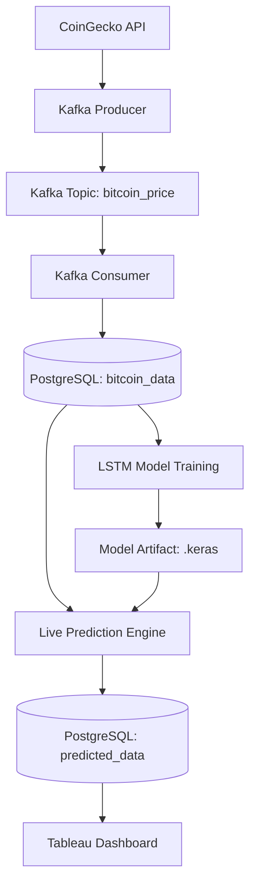

# Bitcoin Price Prediction with LSTM

A real-time data engineering and machine learning pipeline for Bitcoin price prediction using LSTM neural networks, Kafka streaming, and PostgreSQL storage.

## 🚀 Features

- **Real-time Data Ingestion**: Streams live cryptocurrency data from CoinGecko API via Apache Kafka
- **LSTM Prediction Model**: Uses stacked LSTM layers to predict Bitcoin price movements
- **Persistent Storage**: PostgreSQL database for both raw market data and predictions
- **Live Inference**: Continuous prediction loop with real-time model inference
- **Visualization**: Tableau dashboard for comparing actual vs predicted prices

## 📊 Architecture



## 🛠️ Technology Stack

| Component | Technology |
|-----------|------------|
| **Streaming** | Apache Kafka, ZooKeeper |
| **Database** | PostgreSQL |
| **ML Framework** | Keras/TensorFlow |
| **Data Processing** | Pandas, NumPy, Scikit-Learn |
| **Orchestration** | Docker Compose |
| **Visualization** | Tableau |

## 📁 Project Structure

```
├── Bitcoin Data Kafka.ipynb    # Kafka producer/consumer for data streaming
├── LSTM.ipynb                  # LSTM model training and evaluation
├── Live_Data_pred.ipynb        # Real-time prediction inference
├── docker-compose.yml          # Kafka and ZooKeeper orchestration
├── bitcoin_price_model.keras   # Trained LSTM model
├── bitcoin_price_scaler.pkl    # Data scaler for preprocessing
└── Real Time.twb              # Tableau dashboard
```

## 🚀 Quick Start

### Prerequisites

- Docker and Docker Compose
- Python 3.8+
- PostgreSQL
- Conda (recommended)

### Setup

1. **Start Kafka Infrastructure**
   ```bash
   docker-compose up -d
   ```

2. **Set up Python Environment**
   ```bash
   conda create -n bitcoin-prediction python=3.10
   conda activate bitcoin-prediction
   pip install -r requirements.txt
   ```

3. **Configure Database**
   - Create PostgreSQL database named 'Bitcoin'
   - Update connection parameters in notebooks if needed

4. **Run Data Pipeline**
   - Execute `Bitcoin Data Kafka.ipynb` to start streaming
   - Run `LSTM.ipynb` to train the model
   - Start `Live_Data_pred.ipynb` for real-time predictions

## 📈 Model Details

- **Architecture**: Two LSTM layers with 50 units each + Dense output layer
- **Input Window**: 10 time steps of historical price data
- **Preprocessing**: MinMaxScaler normalization
- **Training**: 70/30 train-test split with early stopping

## 🔄 Data Flow

1. **Data Ingestion**: Producer fetches BTCUSDT data from CoinGecko API every minute
2. **Streaming**: Data published to Kafka topic `bitcoin_price`
3. **Storage**: Consumer persists data to `public.bitcoin_data` table
4. **Training**: LSTM model trained on historical OHLCV data
5. **Inference**: Real-time predictions generated every 60 seconds
6. **Visualization**: Tableau connects to PostgreSQL for live dashboards

## 📊 Database Schema

### bitcoin_data table
- `event_time`: Timestamp
- `open_price`, `high_price`, `low_price`, `close_price`: OHLC values
- `volume`: Trading volume

### predicted_data table
- `timestamp`: Primary key
- `actual_value`: Real price
- `predicted_value`: Model prediction

## 🤝 Contributing

1. Fork the repository
2. Create a feature branch
3. Make your changes
4. Add tests if applicable
5. Submit a pull request

## 📄 License

This project is licensed under the MIT License - see the LICENSE file for details.

## 🔍 Key Functions

- `fetch_data()`: Retrieves data from PostgreSQL [1](#0-0) 
- `create_window_data()`: Creates time series windows for LSTM [2](#0-1) 
- `make_predictions()`: Generates real-time predictions [3](#0-2) 
- `insert_predictions()`: Stores predictions in database [4](#0-3) 

## Notes

- The system uses a window size of 10 time steps for LSTM input [5](#0-4) 
- Predictions are made every 60 seconds in the live inference loop [6](#0-5) 
- The model uses two LSTM layers with 50 units each [7](#0-6) 
- Database connection uses default credentials (dbname='Bitcoin', user='postgres', password='root') [8](#0-7) 

Wiki pages you might want to explore:
- [Project Overview (ajinkyachintawar/bitcoin-prediction-lstm)](/wiki/ajinkyachintawar/bitcoin-prediction-lstm#1)

### Citations

**File:** LSTM.ipynb (L31-33)
```text
    "conn = psycopg2.connect(\n",
    "    \"dbname='Bitcoin' user='postgres' host='localhost' password='root'\"\n",
    ")"
```

**File:** LSTM.ipynb (L44-51)
```text
    "def fetch_data():\n",
    "    try:\n",
    "        cur = conn.cursor()\n",
    "        cur.execute(\"SELECT * FROM public.bitcoin_data ORDER BY event_time ASC\")\n",
    "        rows = cur.fetchall()\n",
    "        columns = [desc[0] for desc in cur.description]\n",
    "        df = pd.DataFrame(rows, columns=columns)\n",
    "        return df\n",
```

**File:** LSTM.ipynb (L97-103)
```text
    "def create_window_data(data, window_size):\n",
    "    X, y = [], []\n",
    "    for i in range(len(data) - window_size):\n",
    "        window = data[i:(i + window_size)]\n",
    "        X.append(window)\n",
    "        y.append(data.iloc[i + window_size])  # Use iloc for indexing\n",
    "    return np.array(X), np.array(y)\n"
```

**File:** LSTM.ipynb (L113-114)
```text
    "# Choose the window size (number of past time steps to consider)\n",
    "window_size = 10\n"
```

**File:** LSTM.ipynb (L151-156)
```text
    "# Build LSTM model\n",
    "model = Sequential()\n",
    "model.add(Input(shape=input_shape))\n",
    "model.add(LSTM(units=50, return_sequences=True))\n",
    "model.add(LSTM(units=50))\n",
    "model.add(Dense(units=1))\n",
```

**File:** Live_Data_pred.ipynb (L284-288)
```text
    "def make_predictions(model, live_data, scaler, window_size):\n",
    "    X_live = live_data['close_price_scaled'].values.reshape(-1, 1)\n",
    "    predictions = model.predict(X_live)\n",
    "    predictions_actual = scaler.inverse_transform(predictions)\n",
    "    return predictions_actual\n",
```

**File:** Live_Data_pred.ipynb (L291-300)
```text
    "def insert_predictions(timestamps, actual_values, predicted_values):\n",
    "    try:\n",
    "        cur = conn.cursor()\n",
    "        for i in range(len(timestamps)):\n",
    "            cur.execute(\"INSERT INTO predicted_data (timestamp, actual_value, predicted_value) VALUES (%s, %s, %s) ON CONFLICT (timestamp) DO UPDATE SET actual_value = EXCLUDED.actual_value, predicted_value = EXCLUDED.predicted_value\", (timestamps[i], float(actual_values[i]), float(predicted_values[i][0])))\n",
    "        conn.commit()\n",
    "        print(\"Predictions inserted successfully into PostgreSQL.\")\n",
    "    except Exception as e:\n",
    "        print(\"Error inserting predictions into PostgreSQL:\", e)\n",
    "        conn.rollback()\n",
```

**File:** Live_Data_pred.ipynb (L302-303)
```text
    "# Define the interval for fetching new data and making predictions (in seconds)\n",
    "prediction_interval = 60  # Every minute\n",
```
