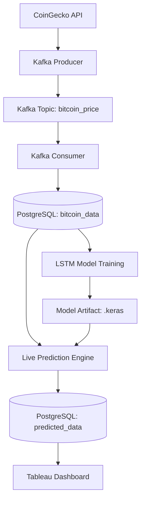

# Bitcoin Price Prediction with LSTM

A real-time data engineering and machine learning pipeline for Bitcoin price prediction using LSTM neural networks, Kafka streaming, and PostgreSQL storage.

## 🚀 Features

- **Real-time Data Ingestion**: Streams live cryptocurrency data from CoinGecko API via Apache Kafka
- **LSTM Prediction Model**: Uses stacked LSTM layers to predict Bitcoin price movements
- **Persistent Storage**: PostgreSQL database for both raw market data and predictions
- **Live Inference**: Continuous prediction loop with real-time model inference
- **Visualization**: Tableau dashboard for comparing actual vs predicted prices

## 📊 Architecture



## 🛠️ Technology Stack

| Component | Technology |
|-----------|------------|
| **Streaming** | Apache Kafka, ZooKeeper |
| **Database** | PostgreSQL |
| **ML Framework** | Keras/TensorFlow |
| **Data Processing** | Pandas, NumPy, Scikit-Learn |
| **Orchestration** | Docker Compose |
| **Visualization** | Tableau |

## 📁 Project Structure

```
├── Bitcoin Data Kafka.ipynb    # Kafka producer/consumer for data streaming
├── LSTM.ipynb                  # LSTM model training and evaluation
├── Live_Data_pred.ipynb        # Real-time prediction inference
├── docker-compose.yml          # Kafka and ZooKeeper orchestration
├── bitcoin_price_model.keras   # Trained LSTM model
├── bitcoin_price_scaler.pkl    # Data scaler for preprocessing
└── Real Time.twb              # Tableau dashboard
```

## 🚀 Quick Start

### Prerequisites

- Docker and Docker Compose
- Python 3.8+
- PostgreSQL
- Conda (recommended)

### Setup

1. **Start Kafka Infrastructure**
   ```bash
   docker-compose up -d
   ```

2. **Set up Python Environment**
   ```bash
   conda create -n bitcoin-prediction python=3.10
   conda activate bitcoin-prediction
   pip install -r requirements.txt
   ```

3. **Configure Database**
   - Create PostgreSQL database named 'Bitcoin'
   - Update connection parameters in notebooks if needed

4. **Run Data Pipeline**
   - Execute `Bitcoin Data Kafka.ipynb` to start streaming
   - Run `LSTM.ipynb` to train the model
   - Start `Live_Data_pred.ipynb` for real-time predictions

## 📈 Model Details

- **Architecture**: Two LSTM layers with 50 units each + Dense output layer
- **Input Window**: 10 time steps of historical price data
- **Preprocessing**: MinMaxScaler normalization
- **Training**: 70/30 train-test split with early stopping

## 🔄 Data Flow

1. **Data Ingestion**: Producer fetches BTCUSDT data from CoinGecko API every minute
2. **Streaming**: Data published to Kafka topic `bitcoin_price`
3. **Storage**: Consumer persists data to `public.bitcoin_data` table
4. **Training**: LSTM model trained on historical OHLCV data
5. **Inference**: Real-time predictions generated every 60 seconds
6. **Visualization**: Tableau connects to PostgreSQL for live dashboards

## 📊 Database Schema

### bitcoin_data table
- `event_time`: Timestamp
- `open_price`, `high_price`, `low_price`, `close_price`: OHLC values
- `volume`: Trading volume

### predicted_data table
- `timestamp`: Primary key
- `actual_value`: Real price
- `predicted_value`: Model prediction

## 🤝 Contributing

1. Fork the repository
2. Create a feature branch
3. Make your changes
4. Add tests if applicable
5. Submit a pull request

## 📄 License

This project is licensed under the MIT License - see the LICENSE file for details.

## 🔍 Key Functions

- `fetch_data()`: Retrieves data from PostgreSQL
- `create_window_data()`: Creates time series windows for LSTM
- `make_predictions()`: Generates real-time predictions
- `insert_predictions()`: Stores predictions in database

## Notes

- The system uses a window size of 10 time steps for LSTM input
- Predictions are made every 60 seconds in the live inference loop
- The model uses two LSTM layers with 50 units each 
- Database connection uses default credentials (dbname='Bitcoin', user='postgres', password='root')

